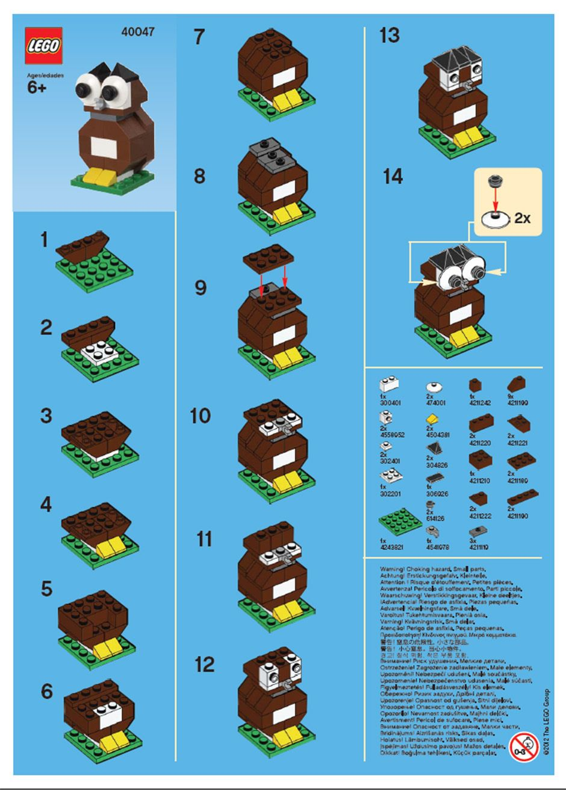
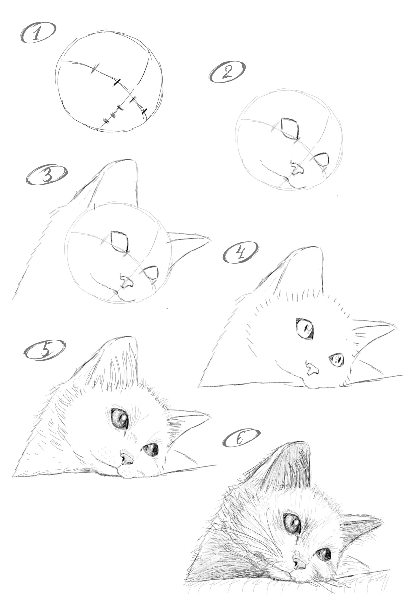
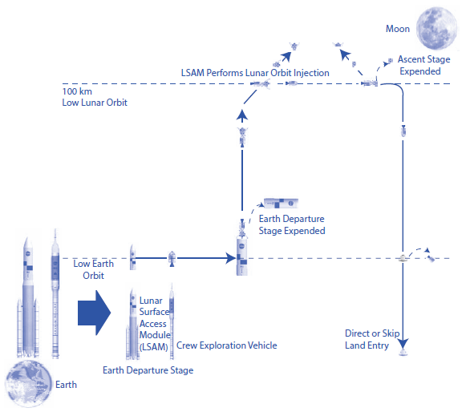
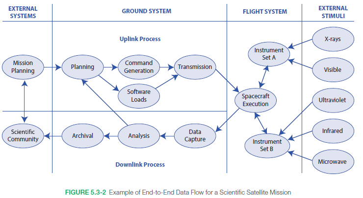
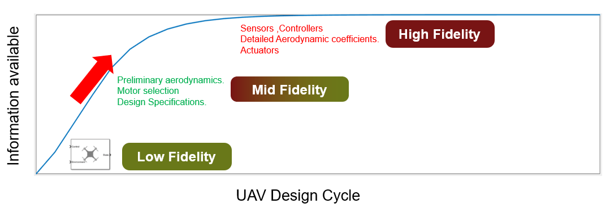
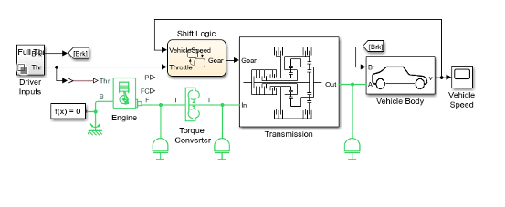
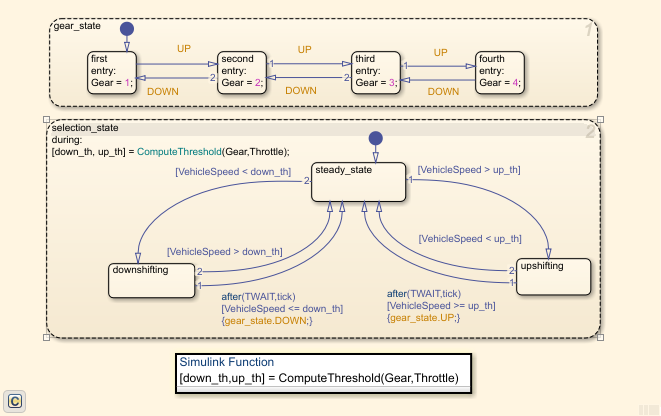

As we have discussed in the [[Let's talk about requirements]] section, the development process should support the rapid creation of representative prototypes to showcase the development team's ideas.

Products can contain multiple complex systems with mechanical, mechatronics, hardware, and software components. These alone could be hard to develop and the integration of them into one system is exponentially harder. 

## How to eat an elephant?

The best way to tackle with a big problem is to chunk it up into reasonable sizes. But how do you divide the problem and what is a reasonable size?

One approach is to define each module in high detail and integrate them from the bottom-up. This method is commonly used in _waterfall_ development processes and offers the advantage of easier test case definition for individual interfaces and functions. However, when a large number of system elements exist at the same level and the system as a whole does not function until the final module is added, system-level functionality cannot be observed during partial integration. This leads to longer development times due to the extended period required to reach system-level testing.

/// caption
LEGO instruction
///

However, we can approach this issue similarly to how we draw a picture. We start by loosely sketching the main elements, ensuring their proportions, positions, and spacing align with our vision of what the picture should represent. Once we are satisfied with the basic sketch, we add more details to better depict the elements. If necessary, we erase parts of the sketch and redraw them, incorporating the feedback we’ve gathered. This process is repeated until we reach the final level of detail in our drawing.

/// caption
how to draw a cat
///

In product development terms, the process starts with system elements related to the overarching framework, which are generally aligned with the mission or users' vision. It continues with system elements that perform core or more detailed functions and ends with system elements handling even finer tasks, such as acquiring data from sensors and issuing commands to actuators. The disadvantage of this approach is that it requires many mock entities for the undefined system elements. The advantage, however, is the early availability of a system skeleton, which makes it easier to detect and locate remaining anomalies. Same way how the sketch of our drawing helped to gather feedback.

## Models - the sketches of systems

A system can be understood as consisting of three things:

- goal or purpose
- interconnections
- elements

*"Sketching up"* a system starts from the mission point of view and the sketch should represent the elements and their interconnections so that we can evaluate if the system achieves its purpose. There are standards like SysML that help to standardise the visualisation of a system with diagrams.

/// caption
NASA mission chart
///

/// caption
data flow in satellite mission
///

However, what works on paper doesn't always work in the field. The models have to be executed to gather verification and validation feedback for the design. This is where simulation comes into the picture. Models usually executed in simulated environment of the plant and the results are evaluated in the context of the fidelity of the simulation.

/// caption
simulation fidelity in design cycle
///

Using models of the system with simulation helps to achieve the iterative approach we can do with top-down integration, before we write a detailed specification for the system elements and their intercommunication. This approach is often referred to as **model-driven development (MDD)**.

/// caption
vehicle model in Simulink
///

/// caption
shifting logic in Simulink
///

## What do we get in the end?

No plan survives first contact with the enemy and the final implementation will be different anyway. So why bother with MDD?

In the end, we could get more out from model-based system engineering than fancy diagrams. The same way as a blueprint for a mechanical part defines the specification on what component we need, the model help us to write specification for our system components.

Keeping the analogy of a mechanical part's blueprint, using 3D CAD and FEM models helped engineers verify and validate their design decision before it went to the implementation phase. The same way a system model can help with system architectural and logical decisions via evaluating them in simulation. Reducing the cost of mistakes significantly, and decreasing development time.

Some tools, like Simulink, also offer code generation features. Meaning that for example the C/C++ the control algorithm can be generated from the model of the algorithm, keeping the model and the implementation tightly linked.

The created simulations can be also reused on the realised system to verify and validate the implementation.